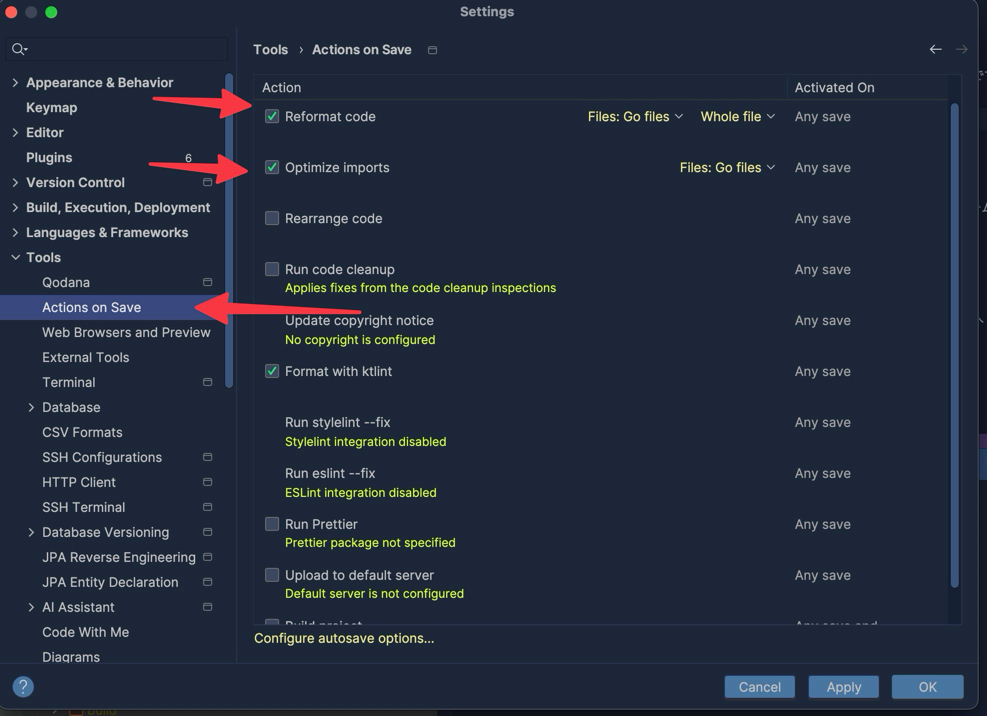

# IntelliJ について

弊社では 申請すればライセンスもらえるというところもあり IDE 人口が IntelliJ が最近は８割ぐらいいそうな感じです。

Java の IDE では他にも Eclipse や NetBeans などがありますが、特に、Java を今まで触っていなかった人には IntelliJ の利用をおすすめします。
IntelliJ は、Java の良くない記法などを黄色く表示して警告してくれるので、初心者には特におすすめです。

## しておきたい設定

IntelliJ IDEA では、`Actions on Save` の設定が可能です。
保存時に再フォーマットと、import の最適化をしておくと良いです。

昔は Save actions というプラグインが必要でしたが、最近は IntelliJ に標準で入っています。

## 入れたほうが良いプラグイン

IntelliJ はプラグインで拡張可能ですが、以下のプラグインは特におすすめです。

